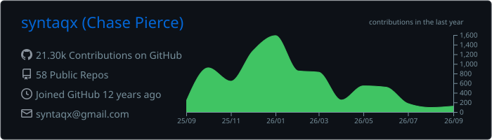
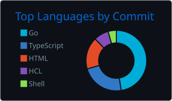
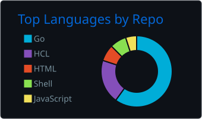

# syntaqx (/ˈsɪnˌtæks/)

https://syntaqx.com

|                                                            |           |
| ---------------------------------------------------------- | --------- |
|  | `#00D1CA` |
|     | `#1A1A1A` |
|    | `#334B49` |
|    | `#95B1AE` |
|    | `#FF9CC7` |
|    | `#C86691` |

## Projects

- [🍪 cookie](https://github.com/syntaqx/cookie) - cookie structs
- [🌱 env](https://github.com/syntaqx/env) - an environment variable utility package
- [🗅 nullable](https://github.com/syntaqx/nullable) - A way to represent nullable types in Go with JSON serialization
- [🍽️ serve](https://github.com/syntaqx/serve) · a static http server anywhere you need one.
- [📣 echo-server](https://github.com/syntaqx/echo-server) - a simple server for http testing purposes
- [🎣 git-hooks](https://github.com/syntaqx/git-hooks) · A collection of useful Git hooks for use with pre-commit.
- [⚓ syntaqx/setup-kustomize](https://github.com/syntaqx/setup-kustomize) · A simple GitHub Action to install the Kustomize binary

### Coding Challenges

Sometimes I get bored so I do coding challenges for fun.

- [ciphersprint](https://github.com/syntaqx/ciphersprint)
- [fetch-rewards-receipt-processor-challenge](https://github.com/syntaqx/fetch-rewards-receipt-processor-challenge)
- [leetcode-go](https://github.com/syntaqx/leetcode-go)

### Ice Box

- [immutablewebapps.com](https://immutablewebapps.com) · A framework-agnostic methodology for building and deploying static SPAs.
- [go-metrics-datadog](https://github.com/syntaqx/go-metrics-datadog) · DataDog client reporter for go-metrics

### Archived

- [collect](https://github.com/syntaqx/collect) - Go package that provides functions to perform operations on collections of data
- [echo-middleware](https://github.com/syntaqx/echo-middleware) · HTTP middlewares implemented for echo
- [pass-meter](https://github.com/syntaqx/pass-meter) · Simple password strength testing
- [cachew](https://github.com/syntaqx/cachew) · Powerfully simple caching library

## Identities

- [GitHub](https://github.com/syntaqx)
- [LinkedIn](https://www.linkedin.com/in/syntaqx)
- [Twitter](https://twitter.com/syntaqx)
- [StackOverflow](https://stackoverflow.com/users/1295839/syntaqx)
- [HackerRank](https://www.hackerrank.com/profile/syntaqx)
- [Docker Hub](https://hub.docker.com/u/syntaqx)
- [Twitch](https://www.twitch.tv/syntaqx)
- [Reddit](https://www.reddit.com/user/syntaqx/)
- [Medium](https://medium.com/@syntaqx)
- [Pinterest](https://www.pinterest.com/syntaqx)

## Made with :heart:

- [:email: Contact](mailto:syntaqx@gmail.com)
- [:boom: Become a GitHub Sponsor](https://github.com/sponsors/syntaqx)

<i>
GitHub Sponsors allows you to financially support the people who build and
maintain the open source projects you depend on. One-hundred percent of your
sponsorship goes toward helping me do this more.
</i>

#

